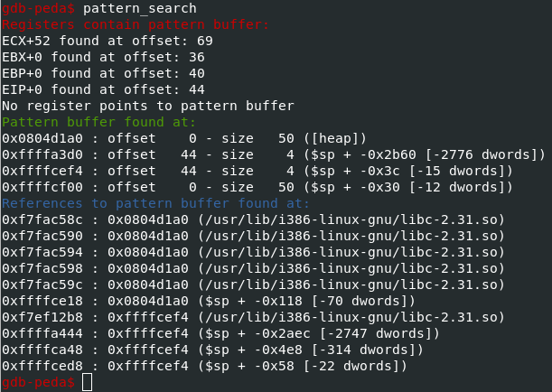

# Buffer Overflow Writeups

This writeup covers the buffer overflow series of challenges (0-3)

## buffer overflow 0 

### Description

> Smash the stack
> Let's start off simple, can you overflow the correct buffer? The program is available [here](./buffer_overflow_0/vuln). You can view source [here](./buffer_overflow_0/vuln.c). And connect with it using: `nc saturn.picoctf.net 64712`

### Hints

> How can you trigger the flag to print?

> If you try to do the math by hand, maybe try and add a few more characters. Sometimes there are things you aren't expecting.

> Run `man gets` and read the BUGS section. How many characters can the program really read?

### Approach

Looking at the provided source code we can see that there is a function that will print the global `flag` variable called `sigsegv_handler`.
We also see that this function is registered as a signal handler for the [SIGSEGV](https://www.tutorialspoint.com/c_standard_library/c_function_signal.htm) signal which occurs when a segmentation fault (segfault) happens.

We can cause a segfault to happen by overflowing the input buffer until we overwrite the return address which will cause the program to attempt to read from invalid memory.
To this end, we know the buffer size is 100 so I inputted 110 characters and got the flag.

## buffer overflow 1 

### Description

> Control the return address.

> Now we're cooking! You can overflow the buffer and return to the flag function in the [program](./buffer_overflow_1/vuln). 
> You can view source [here](./buffer_overflow_1/vuln.c). And connect with it using: `nc saturn.picoctf.net 53642`

### Hints

> Make sure you consider big Endian vs small Endian.

> Changing the address of the return pointer can call different functions.

### Approach

From looking at the source code, we know that there is a `win` function that will give us the flag if we manage to call it.
We also know that the vuln function will read in our input and then print the address of where we are returning to.
Since this appears to be a relatively simple buffer overflow challenge we can assume that there is no [stack canary](https://ir0nstone.gitbook.io/notes/types/stack/canaries) and [PIE/PIC](https://en.wikipedia.org/wiki/Position-independent_code) but let's check using `checksec`.

Now that we know there are no security controls enabled, lets find the address of the win function using [radare](https://rada.re/n/).

You could also use `objdump` if you don't have radare installed.

Now let's find out how many characters it takes until we can control the instruction pointer.
I like using [gdb-peda](https://github.com/longld/peda) for this sort of thing so I'll demonstrate using that.
Using this tool, I'll generate a cyclic pattern larger than the buffer size and then find at what point in that pattern EIP points to.

From the program output we can see that we are jumping to `0x41414641` which we can verify in the output of gdb-peda after the program segfaulted by looking at the EIP register.

Now we'll use the `pattern_search` command within gdb-peda to find the offset at which we can control the EIP value.

From the output we can see that we control EIP after 44 characters. 
Now let's attempt to jump to the address of the `win` function that we found earlier.
I'll be using the [pwntools](https://docs.pwntools.com/en/stable/about.html) library to format the address (rather than manually formatting it in the proper [endianness](https://en.wikipedia.org/wiki/Endianness)).

