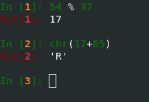
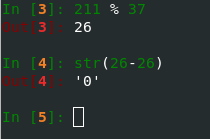
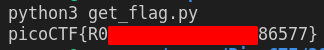

# Challenge name: basic-mod1

## Description

> We found this weird message being passed around on the servers, we think we have a working decrpytion scheme. Download the message [here](./message.txt). Take each number mod 37 and map it to the following character set: 0-25 is the alphabet (uppercase), 26-35 are the decimal digits, and 36 is an underscore. Wrap your decrypted message in the picoCTF flag format (i.e. `picoCTF{decrypted_message}`)

### Hints

> Do you know what mod 37 means?

> `mod 37` means modulo 37. It gives the remainder of a number after being divided by 37.

## Approach

A message is given to us as a list of numbers. 
In order to decode each character of the message we are told to take the modulus and then map the result to one of three ranges.

For values within the alphabet range (0-25), adding the offset of 65 (ascii value of capital A), gives the decoded flag character.

For values that fall within the digit range, we only have to subtract the offset of 26 and then wrap it as a string.

I ended up creating a [script](./get_flag.py) to loop over each number and then decode the value as described above.
After that it's as simple as running the script and we get the flag.

