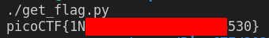

# Challenge name: basic-mod2

## Description

> A new modular challenge! Download the message [here](./message.txt). Take each number mod 41 and find the modular inverse for the result. Then map to the following character set: 1-26 are the alphabet, 27-36 are the decimal digits, and 37 is an underscore. Wrap your decrypted message in the picoCTF flag format (i.e. `picoCTF{decrypted_message}`)

### Hints

> Do you know what the modular inverse is?

> The inverse modulo z of x is the number, y that when multiplied by x is 1 modulo z

> It's recommended to use a tool to find the modular inverses

## Approach

This challenge is very similar to the  challenge.
The only difference is that this time we have to find the modular inverse after we mod it by 41.
After doing some quick searching I found a [Stack Overflow post](https://stackoverflow.com/a/9758173) that details how to find the modular inverse using python.
Apparently you can just use the builtin `pow` function in python 3.8 and above.
Using pretty much the same code from the previous challenge with the addition of the modular inverse, you end up with  that gives us the flag.

