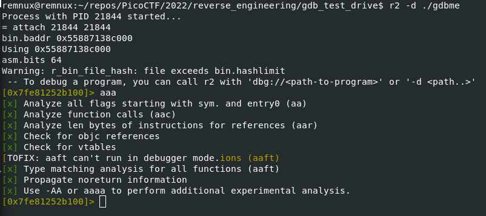
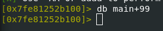
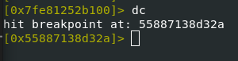
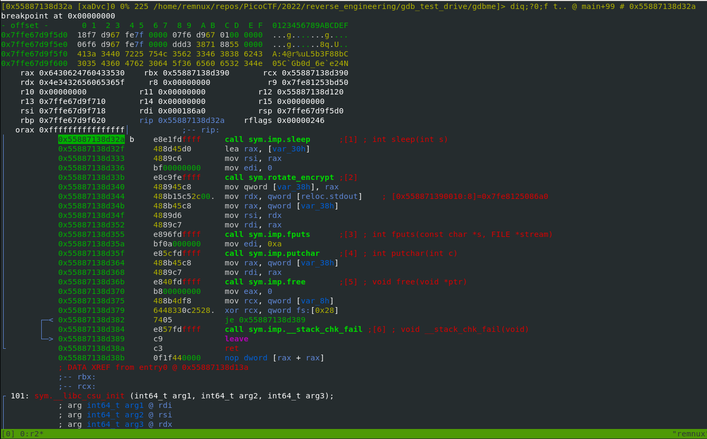
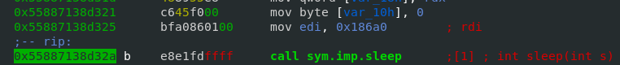
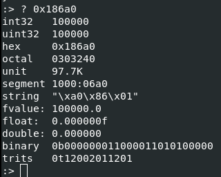
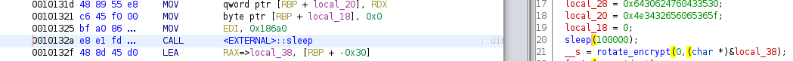
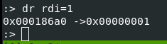
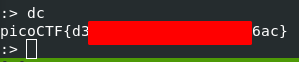

# Challenge name: GDB Test Drive

## Description

> Can you get the flag? 

> Download this [binary](./gdbme)

> Here's the test drive instructions:

- `$ chmod +x gdbme`
- `$ gdb gdbme`
- `(gdb) layout asm`
- `(gdb) break *(main+99)`
- `(gdb) run`
- `(gdb) jump *(main+104)`

## Approach

The aim of this challenge is to introduce us to GDB.
They give you all of the commands to run in order to get the flag so this writeup will look at how to solve the challenge using radare2/r2pipe and what the gdb commands are actually doing.

### radare2

Loading up the binary in radare2 (in debug mode), we will first analyze the binary using the command `aaa`.



The challenge instructions then say to place a breakpoint on *(main+99) so let's do that in radare.
We can place breakpoints using the `db` command followed by the address to place the breakpoint.



After that, the gdb command `run` is the same as radare's `dc` (debug continue) command so let's run that.



At this point in my learning of radare2, I am not aware of what the r2 equivalent of gdb's `jump` command is so I'll be using a different method to solve the challenge.
Switching into visual mode by using the `V` command and then changing views to the debug view `pp` we can see that the next instruction that is about to execute is a call to the sleep function.



Scrolling up using `k` we can see that the value of `0x186a0` is being moved into the rdi register.



This value is most likely being used as the amount of time within the `sleep` function.
We can see what the decimal equivalent of this in radare is by entering `? 0x186a0` while in command mode (`:`)



NOTE: You could also verify that this value is indeed being used as the parameter to sleep by using ghidra's decompiler:



Since we still haven't called the sleep function yet and we know that the amount to sleep is stored within the rdi register, let's change it to a much smaller value using the command `dr rdi=1`.
It then shows us the previous value of rdi as well as the current.



While still in command mode we can use `dc` to continue and get the flag.



### r2pipe

This small [script](./get_flag.py) uses the essential commands from the steps taken above to extract the flag:

```python
import r2pipe

# -d will open the binary in debug mode
# -2 will disable the messages printed to stderr
r = r2pipe.open("./gdbme", ["-d", "-2"])
r.cmd('aaa') # analyze the binary
r.cmd('db main+99') # set a breakpoint before the sleep call
r.cmd('dc') # continue until the breakpoint
r.cmd('dr rdi=1') # change the value being passed to sleep
print(r.cmd('dc')) # continue and print flag
```