# Challenge name: Keygenme

## Description

> Can you get the flag? Reverse engineer this [binary](./keygenme)

## Static Analysis

I initially tried to tackle this challenge using only static analysis with [ghidra](https://ghidra-sre.org/) but that only got me so far.
I will walk through what I got using ghidra but my actual solution is under the [approach](#approach) section.

NOTE: I initially attempted to solve this challenge using only static analysis since I was unfamiliar with radare or gdb when this CTF started.
Using static analysis I was able to get the beginning portion of the flag but not the end.

Loading up the binary in ghidra, I'll navigate to its entrypoint since the `main` function was not found.

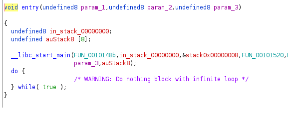

The first parameter passed to `__libc_start_main` is the main function itself so I'll rename that function and then navigate there.

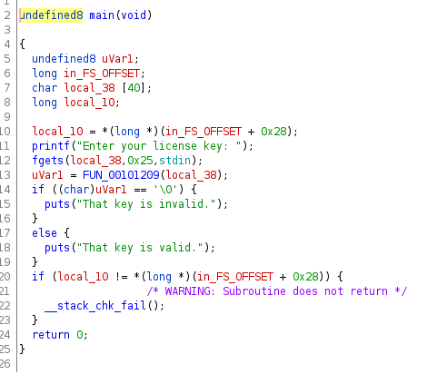

We see that fgets is taking a string of length `0x25` and storing it in `local38` so I will rename this as `key_input`. 
We then see that `key_input` is being passed to the function at `0x101209` and depending on the result of that function call will print valid or invalid to the screen.

Renaming that function to `check_license` and navigating to it we are greeted with a function that contains many local variables.

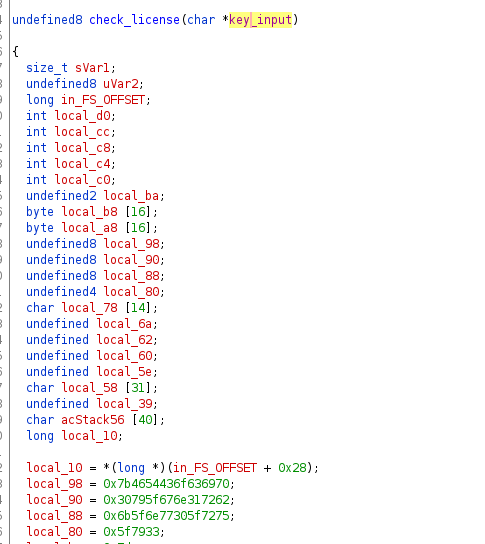

After hovering over the hex values that come after the variable declarations we notice that the flag (or part of it) appears to be stored there.

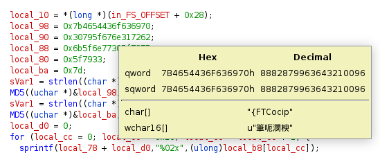

We can use python to quickly decode those hex values into an ascii string like below:

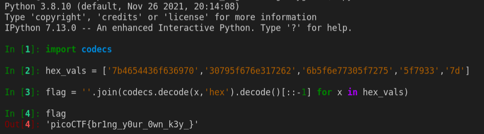

The problem we see is that we are missing the end part of the flag (there should be more after the last underscore).
Looking further in the decompile window, I noticed that the end of the flag appears to be set "manually".

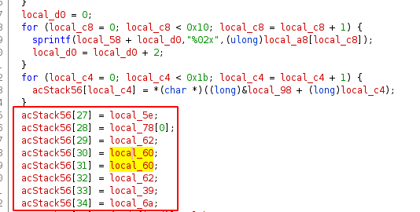

The problem I had with this (and still do) is that those variable appear to be uninitialized (there are no other references to them besides their declaration) so I do not know what those variables are.
Also, my x64 is pretty shoddy at the time of writing this so looking at the disassembly to reason out what those variables could be exceeds my current capabilities.

What I did find interesting is that further on in the function, after all the loops and md5 stuff, we appear to be directly comparing each character of our input with the characters of the `acStack56` variable we just looked at.
This would mean that once the code reaches that part, the flag has been fully loaded and should exist on the stack somewhere.

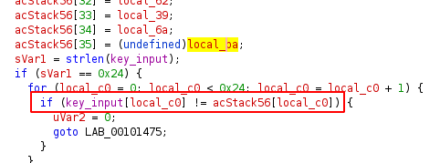

At this point I gave up on attempting static analysis and went off to do some of the binary exploitation challenges to learn radare2 so I could come back and do some dynamic analysis.

## Solution

NOTE: This solution references knowledge gained from doing static analysis using ghidra as detailed above

Loading up the binary in radare using the command `r2 -d keygenme`, I began by analyzing everything (`aaa`) and then taking a look at main.
From our ghidra analysis, we know that the function that checks our input is called right after `fgets`.

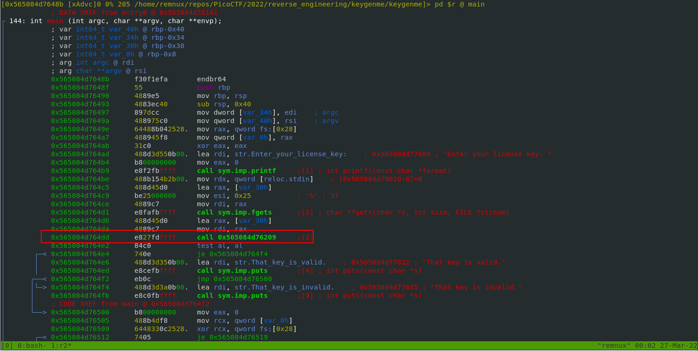

I will give this address a flag and then define it as a function using the commands `f check_license @ <address>` and `af @ check_license`. 
After navigating to the newly defined function we see the big list of local variables.

NOTE: The address will most likely be different on each run.
(I believe this is due to ASLR?)

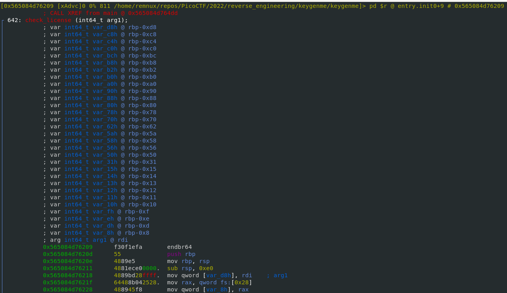

From the ghidra analysis, we know that the flag will be loaded into memory by the time we check the length of our input. 
We can use the slash command in r2 to search for bytes so lets look for a comparison opcode using the `/ad` command.
I used ghidra to verify that the comparison of the string length used the rax register so we can place a breakpoint on the only one that matches our conditions (rax compared with 0x24).

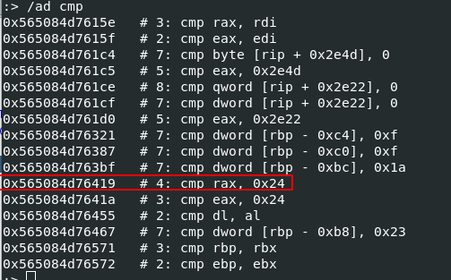

You can do this in visual mode by seeking to that address and then pressing `B` or in command mode with `db <address>`.
We can verify the breakpoint has been set in visual mode by the 'b' next to the address.

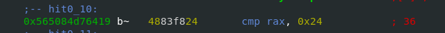

I then continued until the breakpoint was hit using `dc`, entered in a single character when it asked for input (since the length check doesn't matter for our purposes), and switched to panel mode (`!` when in visual mode) to get a look at the stack.
In this view we can actually see the flag located on the stack.

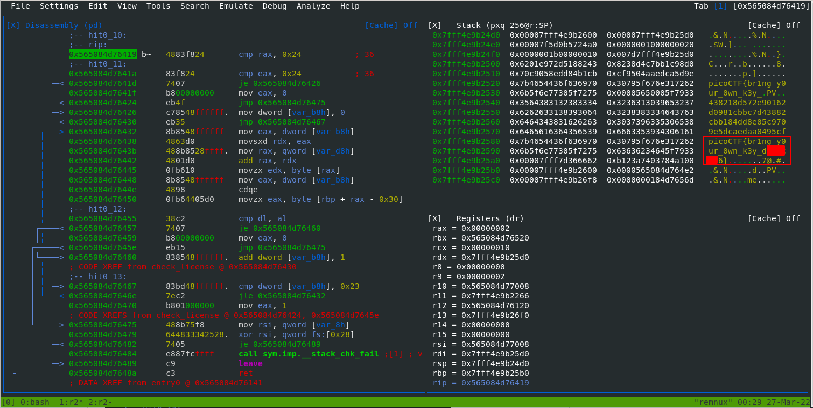

You could also view the stack from command mode with the command `px<length> @ rsp`:

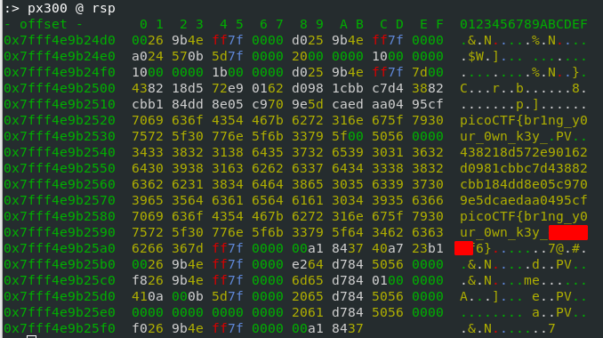

If we wanted to pull that string out we can find its offset on the stack by looking at the disassembly.
Since I'm not too familiar with x64 I used ghidra to find where it actually accesses the constructed flag and how that translates into x64 assembly.

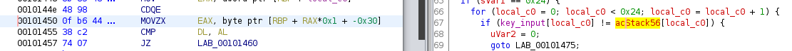

Looking at the disassembly for this part, I inferred that the offset was `0x30` and RAX is the offset of the character we are currently checking (loop iteration value).
With this, we can print the flag from the stack with the command `ps @ rbp-0x30`.

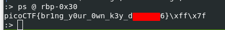
